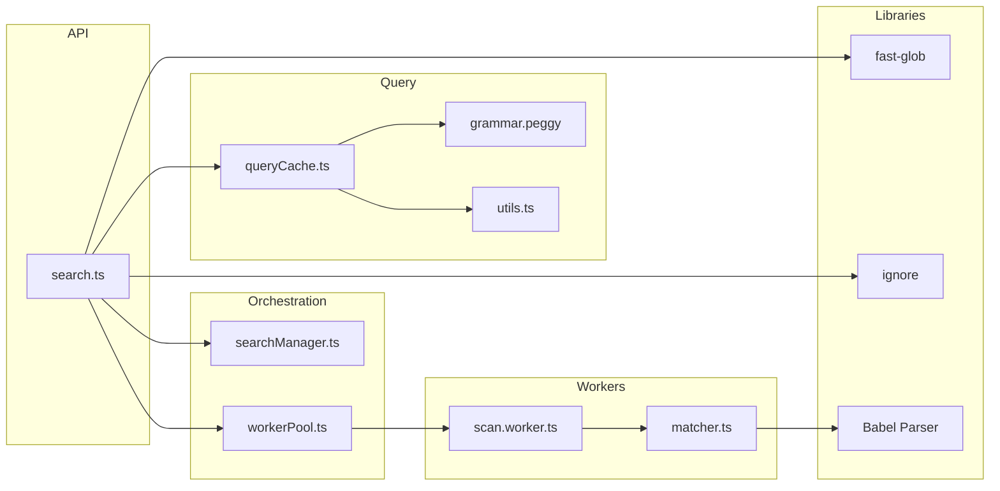
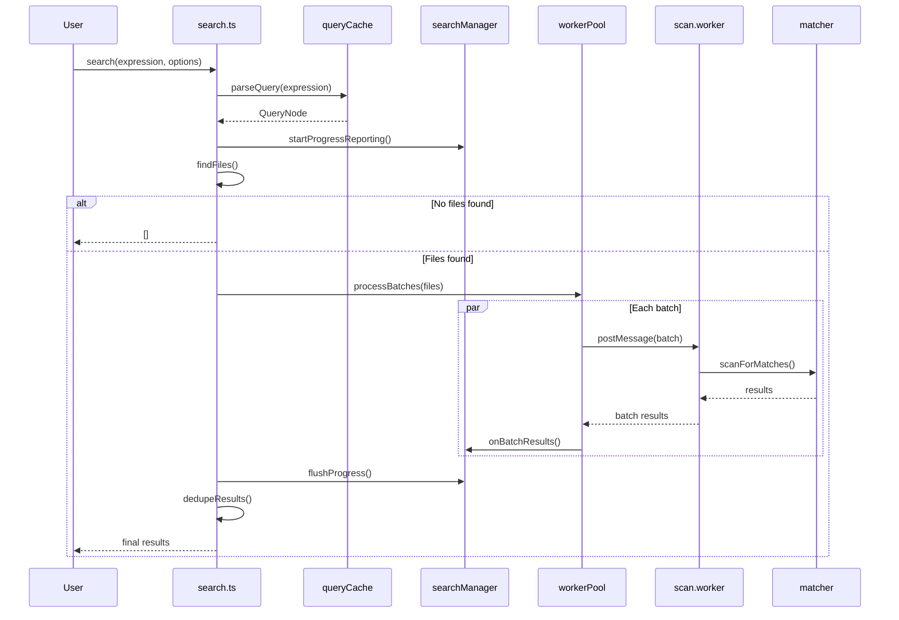
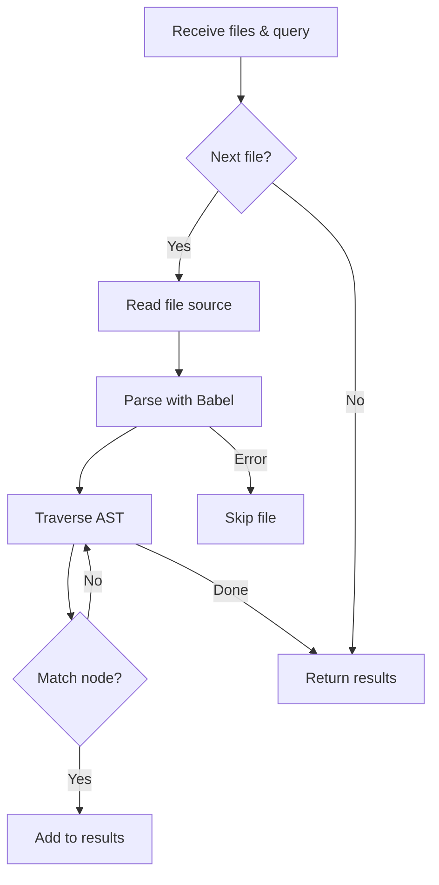
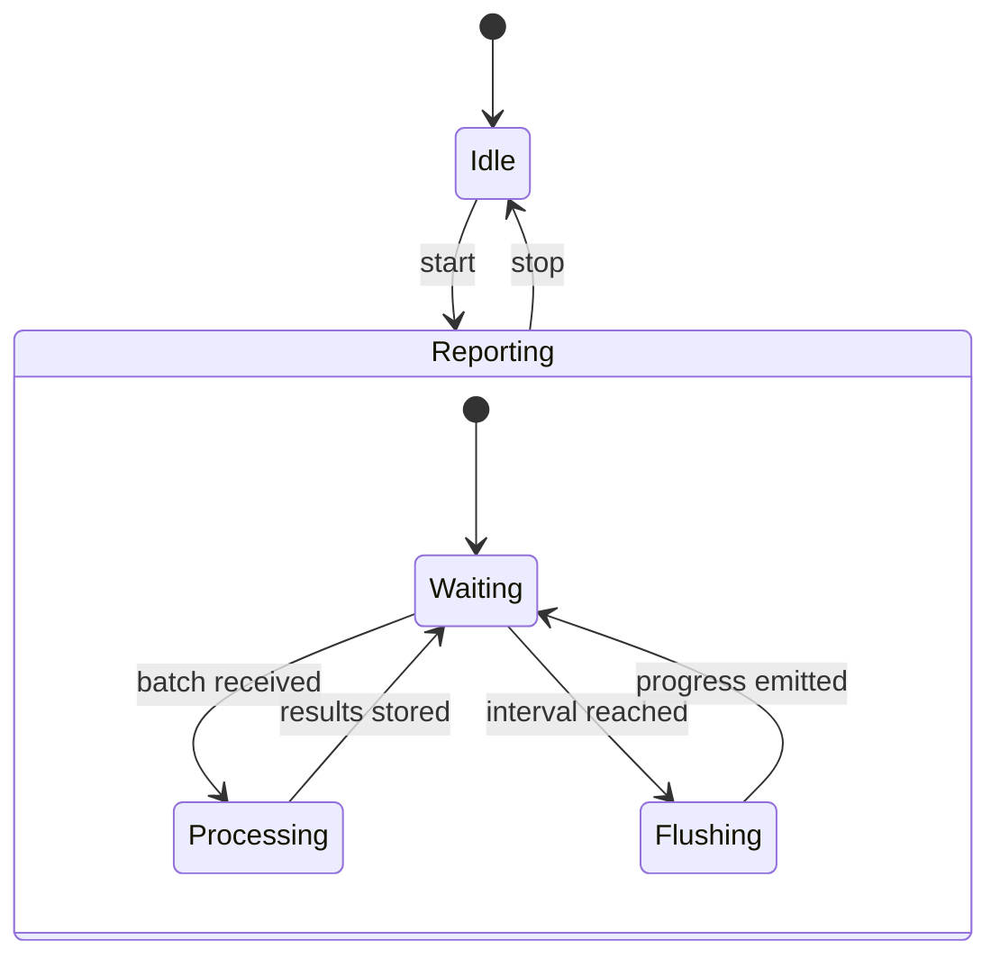
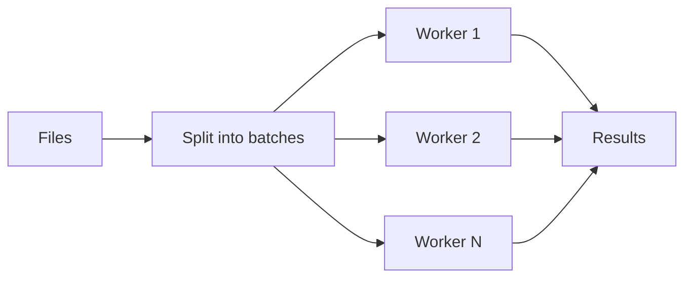
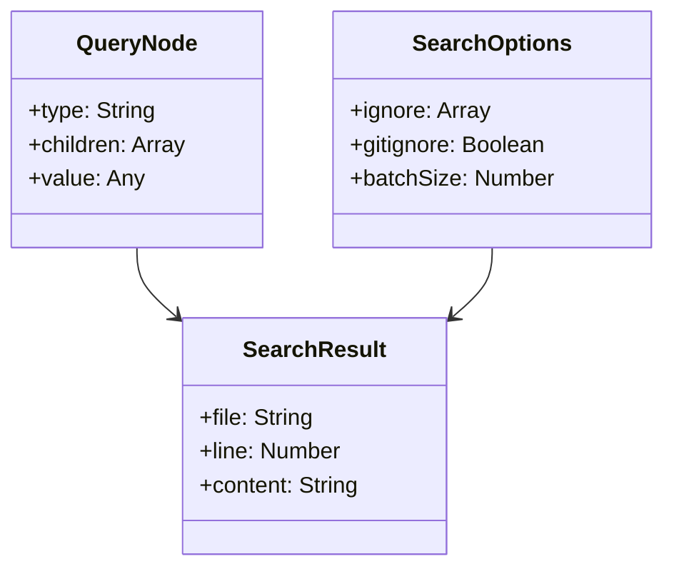

# tsgrep

**tsgrep** is a command-line tool that leverages TypeScript's Abstract Syntax Tree (AST) to perform precise and efficient searches within your codebase. Unlike traditional text-based search tools, tsgrep understands the structure of your code, enabling advanced queries that are both accurate and context-aware.

## 🚀 Features

- **AST-Based Search**: Utilizes TypeScript's AST for accurate code structure analysis.
- **Precise Matching**: Supports searching for specific nodes, functions, variables, and more.
- **Flexible Querying**: Allows for complex queries to match various code patterns.
- **Regular Expression Support**: Integrates regex for powerful pattern matching.
- **File and Directory Filtering**: Search within specific files or directories, or exclude certain paths.
- **Cross-Platform**: Works on Windows, macOS, and Linux.

## 📦 Installation

To install tsgrep globally using Yarn:

```bash
npm i -g tsgrep
```

To install locally in your project:

```bash
git clone https://github.com/shantanu2307/tsgrep.git
cd tsgrep
npm install
npm run build
npm link
```

## 🏗️ Architecture

### High-level Architecture



### Search Flow



### Worker-side Scanning Algorithm



### Progress Reporting



### Batching and Concurrency



### Core Data Types



## 🧪 Usage

### Using it as an API

```javascript
import { search } from 'tsgrep/dist';
// use search(<Expression>, <Directory>, <Options>) to get matches
```

### Search with AST Queries

For more advanced searches, use AST queries to match specific patterns:

```bash
tsgrep "FunctionDeclaration[id=Identifier[name=\"myFunction\"]]"
```

### Search in Specific Files

Limit your search to specific files or directories:

```bash
tsgrep "FunctionDeclaration[id=Identifier[name=\"myFunction\"]]" src/**/*.ts
```

### Exclude Specific Files

To exclude certain files from your search:

```bash
tsgrep "FunctionDeclaration[id=Identifier[name=\"myFunction\"]]" src/**/*.ts --exclude 'src/test/**/*.ts'
```

## Todo

- [ ] Improve performance for large codebases.

## Contributing

Contributions are welcome! Please open an issue or submit a pull request for any improvements or bug fixes.
